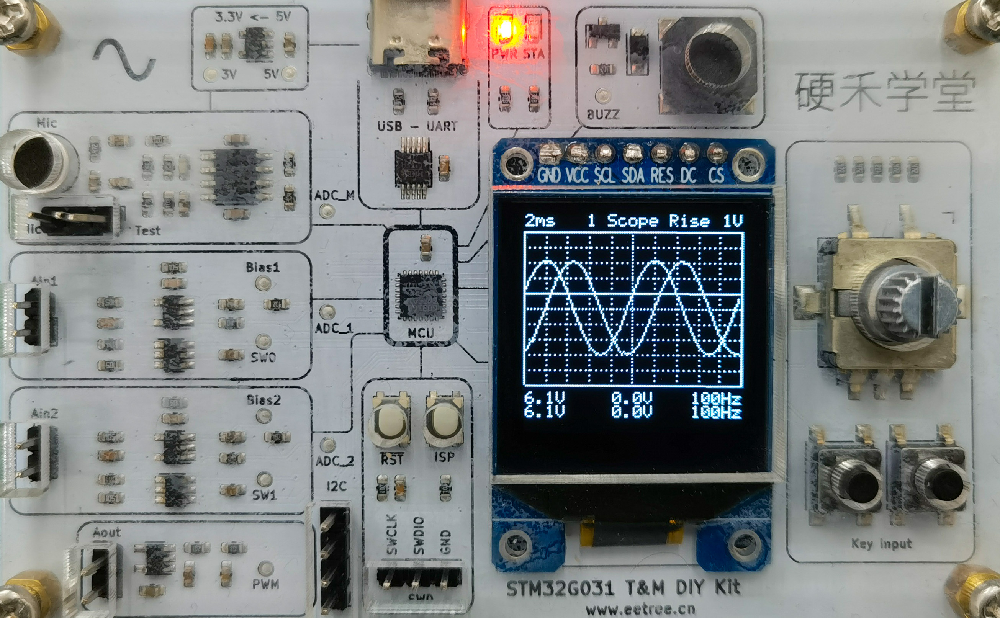
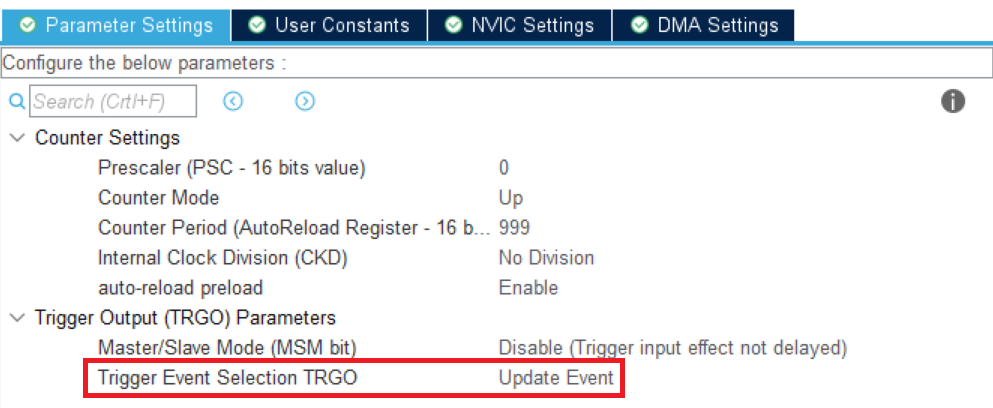
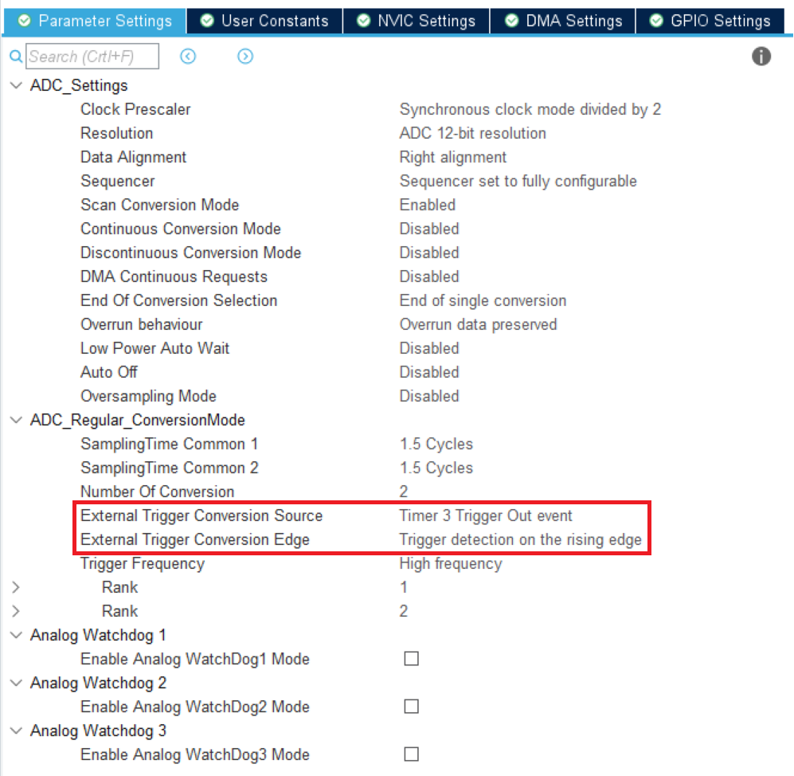
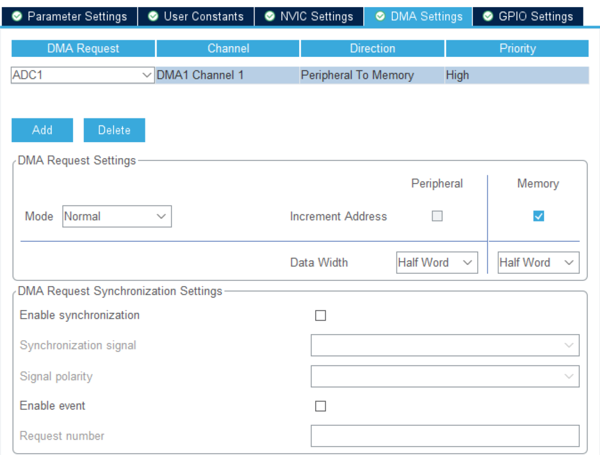

# 基于STM32G031的双通道示波器（带频谱分析功能）

采样率1MSa/s的双通道示波器、频谱仪。
示波器分析带宽为200kHz，支持时间、电压轴缩放，触发电平设置，触发边沿选择，触发通道选择。
频谱仪分析带宽为1MHz，支持频率、电压轴缩放。


## 1. 复现项目

首先需要硬禾学堂推出的STM32G031板卡，详情：https://www.eetree.cn/project/detail/662

### 方法一：烧录bin文件

1. 下载最新版的bin文件：https://github.com/xzqiaochu/scope/releases
2. 使用STM32CubeProgrammer烧录（建议使用2.8.0；不要使用2.9.0，该版本部分字节存在烧写错误；更高版本暂不知晓是否可用）。

### 方法二： 本地编译

1. 环境配置

   项目采用STM32CubeMX + CLion开发，请参考这篇文章配置环境：https://zhewana.cn/2021/c69c321f18aa/

   注：上述文章暂时失效，替代文章：https://www.bilibili.com/read/cv6308000 | https://zhuanlan.zhihu.com/p/160183640

2. 编译

   使用STM32CubeMX打开 scope.ioc，点击 GENGERATE CODE；

   使用CLion打开工程，第一次打开会弹出CMake配置选项卡，新建一个Release配置；

   稍后会弹出面板配置文件选项卡，点击取消；

   打开编辑/调试配置，更改面板配置文件为当前项目根目录下的st_nucleo_g0.cfg；

   使用ST-Link连接板卡，编译下载程序。


## 2. 项目需求

##### **设计一个带频谱分析功能的双通道示波器**

1. 通过STM32G031的ADC采集外部模拟信号，信号幅度范围2mVpp到30Vpp，频率为DC - 50KHz
2. 将采集到的波形显示在128*128的OLED上，并支持电平**触发**的功能
3. 通过FFT进行频谱分析，并将频谱显示在OLED上
4. 测试信号可以通过芯片的PWM+板上LPF的方式产生，比如1KHz、幅度为3V的正弦波
5. 能够自动测量波形的参数 - 峰峰值、平均值、频率/周期
6. 能够通过按键和旋转编码器来对波形进行幅度和时间轴缩放查看


## 3. 完成的功能及达到的性能

### 示波器部分



1. **双通道波形显示**

   可同时显示两个通道的波形，每个通道的最大采样率为1MSa/s，最大分析带宽约为100kHz。

2. **时间轴、电压轴缩放**

   可使用旋转编码器调整时间轴、电压轴刻度；程序会根据选择的时间轴刻度，自动计算合适的采样率。

   时间轴刻度(/div)有：

   ```c
   "100ms",
   "50ms", "20ms", "10ms",
   "5ms", "2ms", "1ms",
   "500us", "200us", "100us",
   "50us", "20us", "10us",
   "5us", "2us", "1us"
   ```

   电压轴刻度(/div)有：

   ```c
   "5V", "2V", "1V",
   "500mV", "200mV", "100mV"
   ```

3. **触发电平设置**

   可使用旋转编码器调整触发电平，触发电平以0.5div步进。时间轴缩放可能导致触发电平不能以0.5div对齐，但程序会保证：每次用户调整电平时，将就近以0.5div对齐。

   触发电平有上下限保护，当用户试图将触发电平调离屏幕显示区域时，程序会阻止并发出提示音。

   时间轴的缩放同样可能导致触发电平偏离屏幕区域，当出现这种情况时，程序将采取以下逻辑：

   - 若用户没有调整触发电平，触发电平的值将保持，绘图程序不会绘制触发电平
   - 若用户尝试调整触发电平，程序会将触发电平首先调整为临近上限/下限的值（就近选择）

4. **触发边沿选择**

   可选择上升沿/下降沿触发。

5. **触发通道选择**

   可选择通道1/通道2作为触发通道。

6. **波形保持**

   按下hold按键，波形将停止刷新，并保持最后一个波形。

   但采样程序、波形参数计算程序会持续运行，当用户解除hold时，将立刻绘制出最后一次采样的波形、信息。（此功能对于诸如100ms/div的大时间刻度十分凑效，可避免长时间采样所带来的等待时间）

### 频谱仪部分


1. **双通道频谱显示**

   可同时显示两个通道的频谱，每个通道的频率范围最大为DC - 1MHz，最大分析带宽约为100kHz。

2. **频率轴、电压轴缩放**

   可使用旋转编码器调整频率轴最大值、电压轴刻度；程序会根据选择的频率轴，自动计算合适的采样率。

   频率轴最大值有：

   ```c
   "100Hz", "200Hz", "500Hz",
   "1kHz", "2kHz", "5kHz",
   "10kHz", "20kHz", "50kHz",
   "100kHz", "200kHz", "500kHz",
   "1MHz"
   ```

   电压轴刻度(/div)有：

   ```c
   "5V", "2V", "1V",
   "500mV", "200mV", "100mV"
   ```

3. **波形保持**

   按下hold按键，波形将停止刷新，并保持最后一个波形。

   但采样程序、FFT程序会持续运行，当用户解除hold时，将立刻绘制出最后一次采样的频率、信息。

   

## 4. 实现过程

### 程序结构

程序采用APP编写，示波器(Scope)、频谱仪(Spectrum) 为两个APP；每个APP均有 `Init()、DeInit()、Loop()` 函数。`os.c`为用户主程序，用来控制APP的运行，并连接Drivers层和APP层。

Drivers层：更关注硬件上的实现，为APP层提供函数接口；

APP层：更关注算法，尽可能避免硬件相关操作，增强移植性。

```mermaid
graph TB
A(main.c)==>I(os.c)
I ==> B & C
C(Spectrum/app.c)

subgraph APP
B(Scope/app.c)--采样程序-->D
B--绘图程序-->E
B--用户操作解析程序-->F
D(sample.c)-.->E
F(operate.c)-.->E
E(UI.c)

G[(global.c)]-.全局变量.->B
H[(settings.c)]-.宏定义.->B
end

J[信号输入]-..->D
K[用户输入]-..->F

subgraph Drivers
L(buzzer.c)
M(key.c)
N(oled.c)
O[(DSP Lib)]
end
```

频谱仪(Spectrum)的结构与示波器(Scope)的结构一致，上图省略未画出。

值得一提的是，对于占用大量内存的全局变量（尤其是数组），APP采用动态申请内存的方式：`Init()`中函数使用`malloc()`申请内存，`DeInit()`中使用`free()`释放内存。这样大量节省了RAM空间。

## 核心算法

主要思路：使用STM32G031内置的ADC进行采样，并使用DMA完成数据搬运；主程序专注于处理采样数据和绘图。

1. **ADC+DMA采样**

   使用STM32CubeMX配置ADC的触发源为TIM的TRGO事件，并开启DMA。详细步骤如下：

   首先选择一个TIM作为触发源，在TIM里配置TRGO为Update Event（更新事件）。

   

   然后在ADC中选择触发源为刚才TIM的TRGO事件。

   

   开启ADC的DMA模式。

   

   程序中使用以下两个函数开启ADC+DMA采样：

   ```c
   HAL_ADC_Start_DMA();
   HAL_TIM_Base_Start();
   ```

   程序对采样数据进行乒乓缓存，每个样本缓冲区有3种状态：未采样(Not)，正在采样(Doing)，完成采样(Finished)。

   DMA会在有未采样(Not)缓冲区的情况下启动，尽快缓存更多的样本。

2. **采样数据处理**

   示波器数据处理：遍历样本缓冲区，计算最大值、最小值、平均值；找到所有的边沿，计算周期/频率；把最靠中间的上升沿（下降沿）作为0时刻。

   查找触发边沿的相关代码：（位置：APP/Scope/sample.c  Scope_Sample_Process_Sub()）

   ```c
   float tri_data = toData(scope_tri_voltage);
   uint16_t edges[2][SCOPE_MAX_EDGE];
   uint16_t edges_cnt[2] = {0};
   for (uint16_t i = SCOPE_TRI_CHECK_NUM; i < (uint16_t) (SCOPE_SAMPLE_NUM - SCOPE_TRI_CHECK_NUM); i++) {
       // 检测数据上升沿
       uint8_t cnt = 0;
       for (uint8_t j = 1; j <= SCOPE_TRI_CHECK_NUM; j++) {
           if ((float) sample->data[i - j][k] < tri_data && (float) sample->data[i + j][k] > tri_data)
               cnt++;
           else
               break;
       }
       if (cnt == SCOPE_TRI_CHECK_NUM && (float) sample->data[i][k] < tri_data) {
           edges[Scope_Edge_Rise][edges_cnt[Scope_Edge_Rise]++] = i;
       }
   
       // 检查数据下降沿
       cnt = 0;
       for (uint8_t j = 1; j <= SCOPE_TRI_CHECK_NUM; j++) {
           if ((float) sample->data[i - j][k] > tri_data && (float) sample->data[i + j][k] < tri_data)
               cnt++;
           else
               break;
       }
       if (cnt == SCOPE_TRI_CHECK_NUM && (float) sample->data[i][k] > tri_data) {
           edges[Scope_Edge_Fall][edges_cnt[Scope_Edge_Fall]++] = i;
       }
   }
   ```
   
   频谱仪数据处理：是用DSP库进行FFT。为了节省空间，采样数组和FFT数组共用同一个，但需要位对齐、转置。
   
   在不开辟额外数组的前提下，进行转置：（位置：APP/Spectrum/sample.c  Spectrum_Sample_Handle_Sub()）
   
   ```c
   // 行列转置
   #define REAL(x) (*((float *) &p64[x]))
   #define IMAGE(x) (*((float *) &p64[x] + 1))
   #define NEXT(x) ((p % SPECTRUM_CHANNEL_NUM) * SPECTRUM_SAMPLE_NUM + (p / SPECTRUM_CHANNEL_NUM))
   
   for (uint16_t i = 0; i < (uint16_t) (SPECTRUM_SAMPLE_NUM * SPECTRUM_CHANNEL_NUM); i++) {
       if (IMAGE(i) == 0) // 标记位为零，表示该数据已经被转置
           continue;
       uint16_t first_p = i;
       uint16_t p = i;
       float val = REAL(i);
       IMAGE(i) = 0;
       while (1) {
           p = NEXT(p);
           if (p == first_p) {
               REAL(p) = val;
               break;
           }
           // 交换 REAL(p) 和 val
           float tmp = REAL(p);
           REAL(p) = val;
           val = tmp;
           
           IMAGE(p) = 0; // 标记位清零
       }
   }
   ```
   
   使用DSP库进行FFT：（位置：APP/Spectrum/sample.c  Spectrum_Sample_Handle_Sub()）
   
   ```c
   #include "arm_math.h" // arm_cfft_f32、arm_cmplx_mag_f32
   #include "arm_const_structs.h" // arm_cfft_sR_f32_len128
   
   arm_cfft_f32(&arm_cfft_sR_f32_len128, fft, 0, 1);
   arm_cmplx_mag_f32(fft, fft, SPECTRUM_SAMPLE_NUM);
   ```


## 5. 尚未实现的功能

1. 目前输入信号的电压范围为 -3.3V~3.3V，可以通过改变反馈数组，增大电压范围；
2. Auto功能，自动调整波形适应屏幕显示，大致实现方法如下：
   - 通过FFT找到最大峰，计算合适的时间刻度、电压刻度
   - 根据波形最大峰、次大峰，计算合适的触发电平
